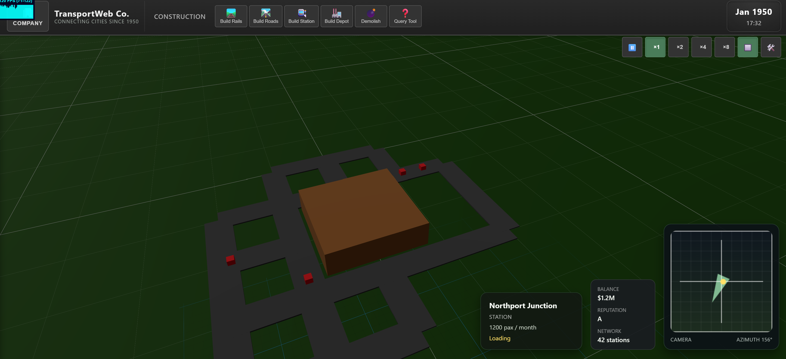

# Transport Tycoon Web

A performant, deterministic, and moddable Transport Tycoon-like simulation game built with React, Three.js, and ECS architecture.



## 🎮 Features

- **Real-time 3D Simulation**: Built with react-three-fiber for smooth 60fps rendering
- **Deterministic Gameplay**: Fixed timestep ensures reproducible game states
- **Entity-Component-System**: Miniplex ECS for efficient simulation of thousands of entities
- **Modern Stack**: React 19, Vite, TypeScript, Zustand
- **Moddable Architecture**: Clean separation of concerns for easy content additions

## 🚀 Getting Started

### Prerequisites

- Node.js 18+ and npm 9+

### Installation

```bash
npm install
```

### Development

```bash
npm run dev
```

Open [http://localhost:3000](http://localhost:3000) to see the game.

### Building

```bash
npm run build
npm run preview
```

## 🧪 Testing

### Unit Tests

```bash
npm test              # Run tests
npm run test:ui       # Open Vitest UI
npm run test:coverage # Generate coverage report
```

### E2E Tests

```bash
npm run test:e2e
```

### Recommended Test Workflow

- Run unit tests locally during development: `npm test` or `npm run test:watch`
- Run e2e tests when you need browser-level validation (they require Playwright browsers): `npm run test:e2e`
- CI runs unit tests first and only runs e2e tests if unit tests pass (see `.github/workflows/ci.yml`).

## 📁 Project Structure

```
src/
  app/           # React application entry
  game/          # Game-specific code
    ecs/         # Entity-Component-System
      systems/   # Game systems (time, physics, economy, etc.)
    state/       # Zustand UI state management
    ui/          # React UI components
    terrain/     # Terrain generation and heightmaps
    input/       # Input handling
  assets/        # Static assets
tests/           # Unit and E2E tests
```

## 🏗️ Architecture

### ECS (Entity-Component-System)

Simulation logic lives in Miniplex ECS:

- **Components**: Transform, Vehicle, Renderable, NetworkNode, etc.
- **Systems**: time, pathfinding, vehicleMotion, cargoFlow, economy
- **Fixed Timestep**: 60fps for deterministic simulation

### State Management

- **ECS**: Simulation state (entities, physics, game logic)
- **Zustand**: UI state (clock, build mode, selection, settings)

### Rendering

- **react-three-fiber**: 3D rendering with Three.js
- **Instancing**: Efficient rendering of repeated geometry
- **Spatial Culling**: Only render visible entities

## 🎯 Development Roadmap

- [x] Phase 1: Foundation (Fixed timestep, camera, grid)
- [ ] Phase 2: Network (Pathfinding, vehicle motion, stations)
- [ ] Phase 3: Economy (Cargo, industries, income)
- [ ] Phase 4: Polish (Save/load, scenarios, undo/redo)

## 📚 Documentation

- [Project Brief](memory/projectbrief.md)
- [Requirements](memory/requirements.md)
- [Design Documents](memory/designs/)
- [Task Tracking](memory/tasks/)

## 🤝 Contributing

This is a learning project. Contributions, issues, and feature requests are welcome!

## 📝 License

MIT

## 🙏 Acknowledgments

- Inspired by Transport Tycoon and OpenTTD
- Built with the amazing Three.js and React ecosystems
