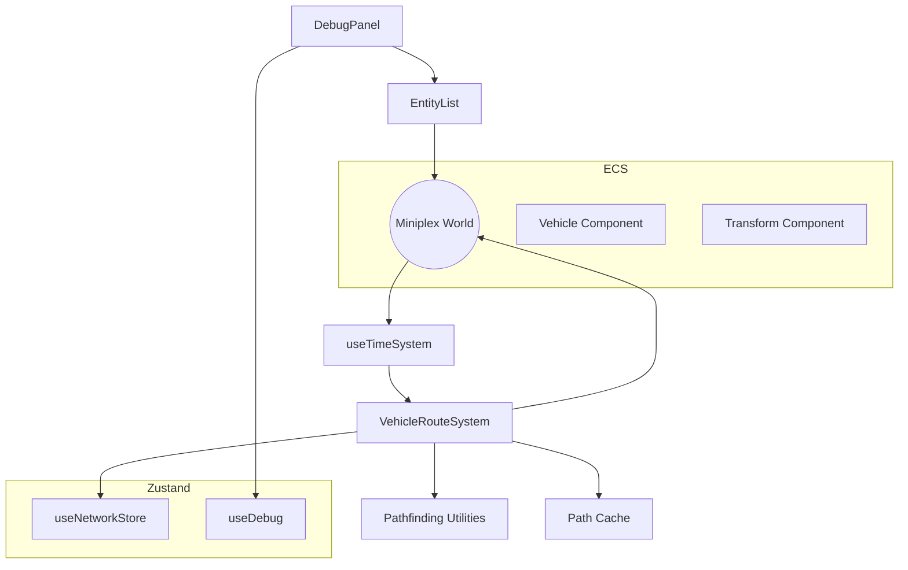

# [DESIGN005] Vehicle Route Following & Debug Entity Inspector

**Status:** In Review (Implementation ready for QA)
**Date:** 2025-10-14
**Related Requirements:** R9, R10, R11
**Related Task:** TASK004

## 1. Problem Statement

Vehicles currently accelerate along the X axis regardless of network layout, and there is no UI affordance to inspect live ECS entities. We need a system that binds vehicles to the transport graph so they request routes, move along edges, and cycle between destinations, plus a toggleable inspector within the debug panel.

## 2. Architecture Overview



## 3. Data Flow

1. **Spawn**
   - Debug panel calls `world.add` to create a vehicle entity.
   - `Vehicle` component includes route metadata initialized with `state: "idle"`.
   - Vehicle route system detects idle vehicles, finds the nearest graph node, selects a destination node, computes a path (using cache + A\*), reserves edges, and updates the component.

2. **Simulation Tick**
   - `useTimeSystem` invokes `advanceVehicles(world, dt)` after integrating paused/speed scaling.
   - Route system updates each vehicle: accelerate, consume distance along current edge, interpolate position, release edges when traversed, and pick a new destination after arrival.
   - If the path becomes invalid (e.g., edge removed), the vehicle transitions to idle and attempts to re-route next tick.

3. **Debug Inspector**
   - Debug panel obtains `showEntityInspector` flag from the debug store.
   - When enabled, it queries `world.entities` filtered by Transform/Vehicle/Renderable to display ID, kind, speed, and target node.
   - List refreshes via local state updated on animation frame to avoid heavy re-renders.

## 4. Interfaces & Contracts

### Vehicle Component Extension

```ts
interface VehicleRouteState {
  state: "idle" | "moving" | "waiting";
  currentNodeId: string | null;
  targetNodeId: string | null;
  path: Path | null;
  currentEdgeIndex: number;
  distanceAlongEdge: number;
  dwellTimeRemaining: number;
}

type VehicleComponent = {
  speed: number;
  accel: number;
  maxSpeed: number;
  type: "train" | "truck";
  route: VehicleRouteState;
};
```

- Vehicles spawn with `route.state = "idle"`.
- `dwellTimeRemaining` enables future station stops (kept for extensibility, zero for now).

### Vehicle Route System API

New module: `src/game/ecs/systems/vehicleRoutes.ts`.

```ts
export function advanceVehicleSimulation(
  world: World<Entity>,
  dt: number,
): void;
```

Responsibilities:

- Ensure each vehicle has a valid path (or stays idle if impossible).
- Move vehicles along edges while respecting acceleration and speed limits.
- Update Transform position/rotation.
- Release/reserve edges and mark graph updates via `useNetworkStore.getState().incrementVersion()` when occupancy changes.

### Debug Store Extension

```ts
export type DebugState = {
  panelVisible: boolean;
  showStats: boolean;
  showEntityInspector: boolean;
  togglePanel(): void;
  closePanel(): void;
  setPanelVisible(visible: boolean): void;
  setShowStats(visible: boolean): void;
  setShowEntityInspector(visible: boolean): void;
};
```

### Debug Panel Entity Inspector

- Added toggle + summary card in the existing panel.
- Renders list with columns: ID, Kind, Position, Vehicle status (speed, destination).
- Uses virtualization-friendly markup (simple `<ul>` with CSS scroll container, limited to 12rem height).

## 5. Algorithms & Pseudocode

### Route Assignment

```
for each vehicle with route.state === "idle":
  currentNode = route.currentNodeId ?? nearestGraphNode(transform.position)
  if !currentNode -> stay idle
  destination = pickDestinationNode(graph, currentNode)
  if !destination -> stay idle
  path = cache.get(currentNode, destination) ?? findPath(graph, currentNode, destination)
  if !path or path.edges.length === 0 -> stay idle
  if reservePath(graph, path, vehicle.id) fails -> stay idle (retry later)
  vehicle.route = {
    state: "moving",
    currentNodeId: currentNode,
    targetNodeId: destination,
    path,
    currentEdgeIndex: 0,
    distanceAlongEdge: 0,
    dwellTimeRemaining: 0,
  }
  setTransformPositionToNode(transform, currentNode)
```

### Movement Tick

```
for each moving vehicle:
  applyAcceleration(vehicle, dt)
  remainingDistance = vehicle.speed * dt
  while remainingDistance > 0 and route.currentEdgeIndex < path.edges.length:
    edge = graph.getEdge(path.edges[index])
    fromNode = graph.getNode(path.nodes[index])
    toNode = graph.getNode(path.nodes[index + 1])
    if edge/toNode missing -> abort route, release remaining edges, set state idle
    edgeRemaining = edge.length - route.distanceAlongEdge
    if remainingDistance < edgeRemaining:
      route.distanceAlongEdge += remainingDistance
      updateTransformAlongEdge(transform, fromNode, toNode, route.distanceAlongEdge / edge.length)
      remainingDistance = 0
    else:
      releaseEdgeOccupancy(edge, vehicle.id)
      route.currentEdgeIndex += 1
      route.currentNodeId = toNode.id
      route.distanceAlongEdge = 0
      updateTransformAtNode(transform, toNode)
      remainingDistance -= edgeRemaining
  if route.currentEdgeIndex >= path.edges.length:
    releasePath(graph, path, vehicle.id)
    route.state = "waiting"
    route.targetNodeId = null
```

### Destination Recycle

- Vehicles in `waiting` state wait a small dwell (e.g., 1 second) then pick a new destination by calling the assignment routine.
- Dwell timer stored in `dwellTimeRemaining`.

## 6. Error Handling Strategy

- If graph nodes/edges referenced in the path disappear, vehicle transitions to `idle` and clears reservations.
- If reservation fails, vehicle remains idle and retries after a 1-second cooldown.
- Debug panel inspector handles empty world gracefully with "No entities" message.

## 7. Testing Strategy

- Unit tests for the route system covering:
  - Path assignment from idle vehicles.
  - Movement along an edge and releasing occupancy.
  - Handling removed edges mid-route.
- Component test for debug panel verifying the toggle reveals entity list rows.
- Integration test (Vitest + ECS) verifying vehicles cycle between two nodes over multiple ticks.

## 8. Task Breakdown

1. Extend memory docs (requirements, design, tasks, active context).
2. Update `Entity` type and Vehicle component to include route state.
3. Implement `vehicleRoutes` system with path assignment, movement, and cache.
4. Integrate system into `useTimeSystem` tick.
5. Update debug panel + store with entity inspector UI.
6. Write unit tests for vehicle routes and debug panel toggle.
7. Run format, lint, and test suites.
8. Capture progress in memory tasks + context, prepare PR summary.

## 9. Open Questions

- Destination selection heuristic (random vs. user-specified) → choose weighted random among reachable nodes for now.
- Station dwell times → scaffold via `dwellTimeRemaining` without UI exposure.
- Performance with 100+ vehicles → monitor; future optimization may use instancing.
