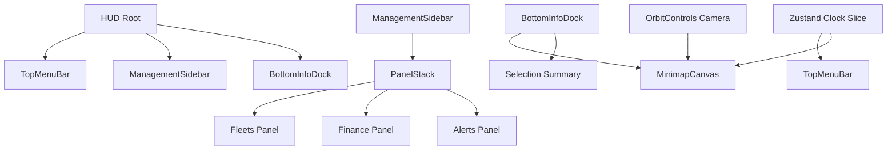

# DESIGN006 - Modern HUD Panels & Minimap

**Status:** Completed
**Date:** 2025-10-16

## 1. Overview

Phase 3 needs a richer HUD that mirrors modern Transport Tycoon titles with live clocks, management sidebars, and minimap overlays. DESIGN006 defines the component structure, styling tokens, and data flow required to deliver requirements R12–R14 without blocking future simulation data integration.

## 2. Goals & Non-Goals

### Goals

- Display an in-game clock tied to the simulation's Zustand clock slice.
- Introduce a management sidebar with modular panels (fleets, finances, alerts).
- Provide a bottom-right minimap overlay wired to the Three.js camera for camera recentering and orientation feedback.
- Maintain responsiveness for desktop and tablet breakpoints.

### Non-Goals

- Persisting UI layout preferences (future iteration).
- Rendering real network geometry inside the minimap (placeholder canvas for now).
- Integrating live economic or vehicle telemetry (stubs only in this pass).

## 3. Architecture



## 4. Data Flow & Interfaces

- `useClock()` already exposes `{ tick, paused, speed }`. Extend slice with derived selectors `formattedDate`, `formattedTime` computed from a `gameTime` value expressed in minutes.
- `ManagementSidebar` reads static stub data (temporary) via local constants. Later it can accept props.
- `MinimapOverlay` uses `useThree()` to access the default camera, storing azimuth and position. Click handling converts 2D canvas coordinates into world offsets and updates the camera target through a helper from `GameCanvas` (`useCameraController`).

### New Interfaces

```ts
interface SidebarPanelDefinition {
  id: string;
  title: string;
  icon: string;
  description: string;
  render: () => React.ReactNode;
}

interface CameraController {
  recenter(position: [number, number, number]): void;
  getAzimuth(): number;
}
```

## 5. Component Breakdown

| Component             | Responsibility                                           | Notes                                               |
| --------------------- | -------------------------------------------------------- | --------------------------------------------------- |
| `HUD`                 | Compose top bar, sidebar toggle, bottom info dock        | Remains portal-free to keep layering simple         |
| `ManagementSidebar`   | Handles slide-in/out animation, renders panel stack      | Controlled by new Zustand UI slice `ui.sidebarOpen` |
| `SidebarPanel`        | Generic panel chrome with header + body scroll           | Accepts `icon`, `title`, `children`                 |
| `FleetSummaryPanel`   | Placeholder dataset (vehicle counts per mode)            | Later sources data from ECS/world                   |
| `FinanceSummaryPanel` | Shows income vs expenses and trend sparkline placeholder |                                                     |
| `AlertFeedPanel`      | Lists recent events                                      |                                                     |
| `BottomInfoDock`      | Hosts minimap and selection info                         | Aligns to bottom-right                              |
| `MinimapOverlay`      | Renders canvas, draws crosshair + orientation wedge      | Uses `requestAnimationFrame` for 2D drawing         |

## 6. Styling System

- Extend existing CSS with BEM-like class names under `.hud-*` namespace.
- Reuse gradient palette (#2a2a2a → #1f1f1f) with accent `#4a7c59`.
- Sidebar width fixed at 320px on desktop, 260px on tablets.
- Animations via `transform: translateX` for GPU-friendly transitions.

## 7. State Management

- Extend `useDebug` slice or create new `useUIStore`? To avoid coupling debug toggles with game UI, add `ui` slice under `state/slices/ui.ts` controlling `sidebarOpen` and `minimapVisible`.
- `MinimapOverlay` subscribes to store for visibility and uses React `useEffect` to subscribe to camera updates.

## 8. Implementation Plan

1. **Clock Enhancements**
   - [ ] Add `gameMinutes` to clock slice with tick integration.
   - [ ] Provide selectors returning formatted date/time for HUD.
2. **UI State Slice**
   - [ ] Create `useUIStore` for sidebar/minimap toggles.
3. **HUD Composition**
   - [ ] Update `HUD` component to include new sidebar toggle and bottom info dock.
   - [ ] Wire TopMenuBar to display formatted clock.
4. **Management Sidebar**
   - [ ] Implement `ManagementSidebar` component + CSS.
   - [ ] Author panel subcomponents with stub data.
5. **Bottom Info Dock & Minimap**
   - [ ] Implement `BottomInfoDock` container and `MinimapOverlay` with simple 2D canvas drawing + camera recenter stub.
   - [ ] Add responsive behavior (hide minimap on narrow screens).
6. **Tests & Validation**
   - [ ] Add Vitest DOM tests verifying sidebar toggle, clock formatting, minimap visibility breakpoints.
   - [ ] Update Playwright scenario to screenshot new HUD (future).

## 9. Open Questions

- Should minimap recenter camera immediately or animate? (future).
- Where should selection summary data originate? (TBD once selection slice built).

## 10. Risks

- Canvas minimap may conflict with R3F render loop if not decoupled; keep as 2D `<canvas>` overlay for now.
- Additional Zustand store watchers could introduce re-render overhead; use shallow selectors.

---

**Next Review:** After implementing TASK006.
