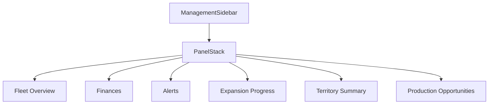

# DESIGN007 - Management Sidebar Growth Dashboard

**Status:** Completed
**Date:** 2025-10-17

## 1. Overview

Players requested deeper management insight covering expansion progress and regional industries. DESIGN007 extends the HUD management sidebar with three new data-focused panels satisfying requirements R15–R17. The additions remain placeholder-driven but architected so future simulation data can drop into the same structures without reworking layout logic.

## 2. Goals & Non-Goals

### Goals

- Surface milestone progress bars summarizing company expansion targets.
- Present territory composition counts for towns, farms, industries, and mines.
- Highlight production opportunities with actionable status chips and freshness indicators.
- Keep implementation data-driven through arrays/maps rather than inline JSX duplication.

### Non-Goals

- Live data plumbing from simulation systems (still stubbed).
- Interactive filtering or sorting of lists.
- Persisting user customization of panel order or visibility.

## 3. Architecture



- `ManagementSidebar` remains the parent orchestrator, mapping static datasets into `SidebarPanel` children.
- Each new panel consumes an array exported inside `ManagementSidebar.tsx` so downstream systems can later import them from dedicated modules.

## 4. Data Structures & Interfaces

```ts
interface MilestoneProgress {
  id: string;
  label: string;
  value: number; // percentage 0-100
  status: string;
}

interface TerritoryCategory {
  id: string;
  label: string;
  count: number;
  status: string;
}

interface OpportunityItem {
  id: string;
  location: string;
  industry: string;
  status: "idle" | "expanding" | "needs-link";
  updatedAgo: string;
}
```

- Progress panel maps `MilestoneProgress` into `<progress>` elements paired with numeric percentage text.
- Territory summary displays `TerritoryCategory` rows with count and qualitative status.
- Opportunities list renders `OpportunityItem` rows with status chips styled via CSS modifiers.

## 5. Styling Plan

- Extend `ManagementSidebar.css` with `.progress-track`, `.progress-bar`, and `.territory-list` classes.
- Create `.status-chip` base style plus modifiers like `.is-expanding`, `.is-idle`, `.needs-link` for color-coded tags.
- Use CSS grid/flex patterns consistent with existing `.metric-list` to maintain TT aesthetic.
- Ensure `<progress>` uses `appearance: none` overrides for custom gradient track/bars matching palette (#4a7c59 accents).

## 6. Implementation Plan

1. **Data Definitions** – Add typed arrays for milestones, territory categories, and opportunity items inside `ManagementSidebar.tsx`.
2. **Component Rendering** – Introduce three new `SidebarPanel` sections that iterate over arrays and render semantic markup (`<progress>`, lists, status chips).
3. **Styling** – Extend CSS for new progress bars, territory grid, and status chips while preserving responsiveness.
4. **Testing** – Update `HUD.test.tsx` to assert visibility of new panels, verify `<progress>` values align with labels, and ensure all territory categories render.
5. **Docs & Memory** – Update memory task file and active context upon completion.

## 7. Risks & Mitigations

- **Risk:** `<progress>` styling inconsistent across browsers. **Mitigation:** Provide fallback background color and width; rely on simple gradient overlay.
- **Risk:** Sidebar vertical space overflow. **Mitigation:** Panels remain collapsible via scroll container already in place and use compact spacing.

## 8. Future Enhancements

- Feed real simulation data for counts and statuses through Zustand selectors.
- Add hover tooltips describing milestone criteria.
- Enable filtering by region or cargo type once underlying systems exist.

---

**Next Review:** After implementing TASK007.
