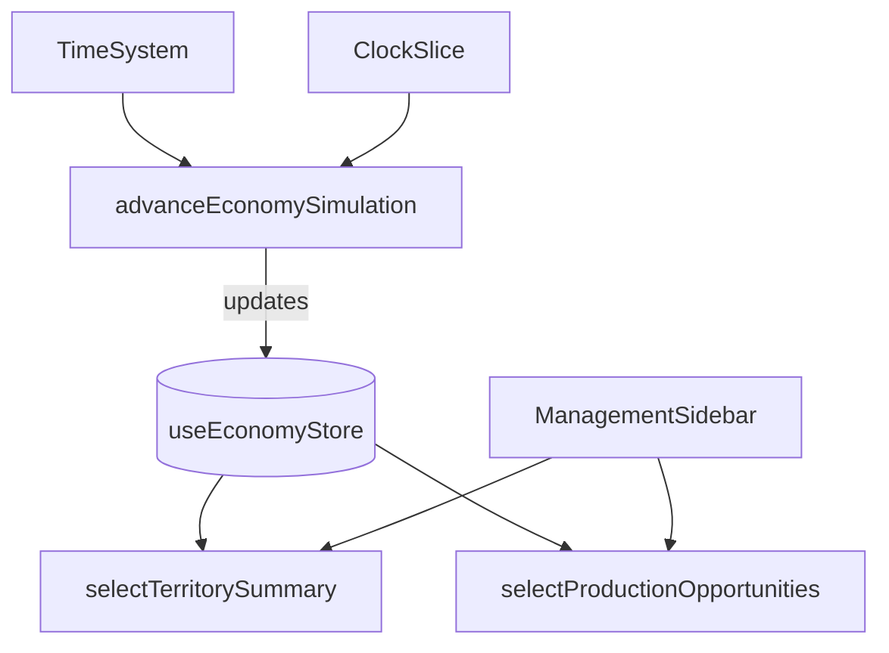

# DESIGN008 - Economy Simulation & Territory Integration

**Status:** Final
**Date:** 2025-10-18

## 1. Overview

Version 2.0 of the transport tycoon economy layers a lightweight simulation for towns, farms, industries, and mines. The goal is to replace placeholder sidebar data with live metrics derived from the simulation loop. The simulation runs on the existing fixed-timestep clock, producing population growth, production throughput, and service opportunities that surface in the HUD.

## 2. Goals & Non-Goals

### Goals

- Track settlement health (population, satisfaction) reacting to network coverage levels.
- Model basic industry supply fulfillment and output stock trends.
- Expose aggregated territory summaries and production opportunities via selectors.
- Integrate the simulation tick with the existing `useTimeSystem` loop and clock slice.

### Non-Goals

- Persisting the simulation across sessions (can leverage future save/load work).
- Rendering in-world settlement meshes (scope is data + HUD wiring only).
- Advanced cargo routing integration; supply fulfillment is abstracted scoring.

## 3. Architecture



- `advanceEconomySimulation` mutates simulation state objects and writes them back into the dedicated Zustand store.
- The store maintains domain entities plus derived aggregates for efficient UI reads.
- Selectors provide memoized transformations to avoid re-render storms.
- `ManagementSidebar` subscribes to selectors instead of static arrays.

## 4. Data Flow

1. `useTimeSystem` calls `advanceEconomySimulation(dt)` after ticking the game clock and vehicles.
2. The simulation converts `dt` into in-game minutes to update populations, satisfaction, fulfillment, and stock levels.
3. Derived attributes (growth trend labels, utilization percentages, opportunity freshness) are recalculated each tick.
4. Zustand store emits updated slices; UI components re-render accordingly.

## 5. Data Models & Interfaces

```ts
type SettlementKind = "town" | "farm" | "industry" | "mine";

type GrowthTrend = "growing" | "stable" | "declining";

type OpportunityStatus = "expanding" | "idle" | "needs-link";

interface BaseSite {
  id: string;
  name: string;
  position: [number, number, number];
  coverage: number; // 0-1 transport service coverage score
  lastCoverageSample: number; // smoothing memory for trend detection
}

interface Town extends BaseSite {
  kind: "town";
  population: number; // residents in thousands
  satisfaction: number; // 0-1
  growthTrend: GrowthTrend;
  rollingDelta: number; // moving average percentage delta
}

interface Farm extends BaseSite {
  kind: "farm";
  outputTonsPerMonth: number;
  utilization: number; // 0-1
}

interface Industry extends BaseSite {
  kind: "industry";
  inputFulfillment: number; // 0-1 supply ratio
  outputStock: number; // stored cargo units
  capacity: number; // max stock
  utilization: number; // derived from fulfillment + stock
  lastStatusChangeMinutes: number; // in-game minutes timestamp
}

interface Mine extends BaseSite {
  kind: "mine";
  outputRate: number;
  exhaustion: number; // 0-1 resource depletion
}

interface ProductionOpportunity {
  id: string;
  location: string;
  industry: string;
  status: OpportunityStatus;
  message: string;
  updatedAgo: string;
}

interface TerritoryCategory {
  id: string;
  label: string;
  count: number;
  status: string;
}
```

## 6. Algorithms

- **Coverage smoothing:** exponential moving average keeps coverage values stable and reacts gradually to network changes (alpha = 0.1 per tick block).
- **Town growth:** logistic growth scaled by satisfaction where `population += population * (baseRate + (satisfaction - 0.5) * modifier) * deltaMonths`. Rolling 30-day window computes percentage change for trend labels.
- **Industry stock:** `outputStock += capacity * (inputFulfillment - 0.5) * deltaMonths`, clamped between 0 and `capacity`. Utilization is average of fulfillment and stock ratio.
- **Farm utilization:** increments/decrements output relative to coverage (no discrete stock).
- **Mine exhaustion:** slowly increases when coverage is high (more extraction) and recovers when idle.
- **Opportunities:** generated for industries with fulfillment < 0.45 (`needs-link`), between 0.45–0.7 (`idle`), or >0.7 (`expanding`). Freshness uses difference between current `gameMinutes` and `lastStatusChangeMinutes`.

## 7. Error Handling

- Clamp all ratios (coverage, satisfaction, utilization) to `[0, 1]` when updated.
- Guard against divide-by-zero by defaulting capacity to >0 and verifying entity arrays exist before aggregation.
- When selectors run before initialization, fall back to empty arrays and zero counts.

## 8. Testing Strategy

- **Unit tests** for `advanceEconomySimulation` verifying population growth, industry stock behavior, and opportunity generation (Requirements R18–R21).
- **Selector tests** ensuring derived summary/opportunity outputs match simulation state snapshots.
- **React component test** stubbing store state to confirm ManagementSidebar renders simulation-driven content.

## 9. Implementation Plan & Tasks

1. **Economy Store (TASK008-1):** Create `useEconomyStore` slice with initial seed data and selectors for territory/opportunities.
2. **Simulation Engine (TASK008-2):** Implement `advanceEconomySimulation` with update helpers for each entity type and integrate into `useTimeSystem`.
3. **UI Wiring (TASK008-3):** Replace static arrays in `ManagementSidebar` with selectors, keeping formatting helpers.
4. **Testing (TASK008-4):** Add unit tests for simulation math and UI rendering using Vitest + Testing Library.
5. **Documentation & Memory (TASK008-5):** Update task file progress, requirements, and active context.

## 10. Dependencies

- Depends on `useClock` for in-game minutes in opportunity freshness.
- Relies on `useNetworkStore` only if future coverage sampling needs graph data (stubbed for now with deterministic values).

## 11. Risks & Mitigations

- **Risk:** Simulation drift causing negative populations or stock. _Mitigation:_ clamp values and assert in tests.
- **Risk:** Frequent store updates causing render thrash. _Mitigation:_ use shallow copies and selectors to minimize React re-renders.
- **Risk:** Inaccurate freshness text due to persistence resets. _Mitigation:_ store timestamps in minutes which survive across ticks, recompute formatting each render.

## 12. Future Enhancements

- Sample actual transport throughput from vehicle logs to drive fulfillment scores.
- Persist simulation state via storage middleware aligned with save/load features.
- Visualize settlements on the world map with overlays and tooltips.

---

**Next Review:** After completing TASK008 implementation.
